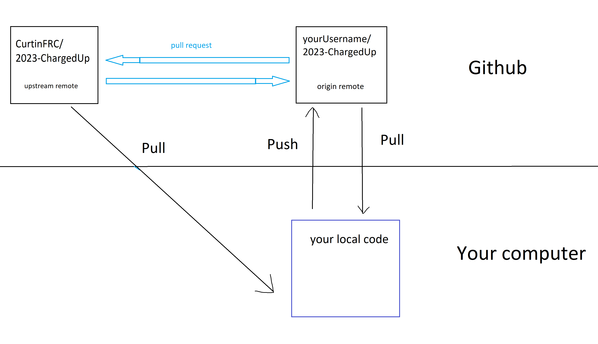

Github
=======

We use Github to manage our code, this means that multiple people can work 
on the code at the same time, it also allows for branch + version control. 
You should be pushing to git everytime you finish something, when you reach a milestone, ect. 
You dont need to push everyday, but you should be pushing at least once a week. 

Getting started 
----------------

To get started with git you need to fork the code from https://github.com/CurtinFRC/2023-ChargedUp.git you can do this by 
pressing the fork button at the top of the page. You can then get the link to your code by pressing the drop down green code button 
and copying the https link. 

In the command line/terminal create + open a new folder (this is where you should store all your frc code) run the command 
``git clone [link]``
you can then go into the folder and open vscode (or other IDE)

Creating remotes
-----------------
Your fork's remote should already be created, you can check this by running the command ``git remote``
it should display ``origin`` this is the remote to your fork, this is where you will be mainly pulling and pushing to. 

If it is not there, DONT WORRY! we can create it. 
Grab the link from your code again and run ``git remote add origin [link]`` you can then check this worked by running ``git remote`` again and seeing if ``origin`` appears. 

We will also need to create ANOTHER remote, this is the upstream remote which you can PULL from to get updated code. 
To do this run: ``git remote add upstream https://github.com/CurtinFRC/2023-ChargedUp.git``

You've made some code! What next?
----------------------------------

So you've made some code that you want to push to your github. 

**Step 1:** Add the changes you've made using ``git add .`` (note the full stop after add)

**Step 2:** Commit the new changes using ``git commit -m "[message]"`` make sure your message is describes to the changes you have made, for example "added shooter PID control"

**Step 3:** Push the changes to your branch using ``git push [remote] [branch]`` [remote] will almost always be origin (your fork of the code), [branch] is whatever branch you are working off, branches are case sensitive.

The code will now by on your fork! Woooooo
If you are ready to merge your code into the main code follow the next steps:

**Step 1** Create a Pull request, on your github click on the tab that says *pull request* then the green button on the top right which says *New pull request*
Select where you are merging from (your fork of the code) and where you are merging to (the main code usually), then click Create Pull Request

**Step 2** Write a pull request message, make sure it's descriptive. On the side pannel add a reviewer, this is one of Anna, Viola, Jaci, Harry, or CJ (usually tag the person who asked you to do something, or viola (programming captain))
Add it to the 2023 Robot Code Project. Then Click Create Pull Request

**Step 3** Wait for someone (Viola, Anna, Jaci, Harry, CJ) to either comment on your PR or merge it in. 

Someone else has made some code!
--------------------------------

So someone else in your team has made some code that you want, after they have got it succesfully merged in you can pull it down directly to your code

**Step 1** Pull from the upstream branch the code is on. ``git pull upstream [branch]`` (you must have committed your own changes to do this)

**Step 2** Merge in changes, do this by navigating to the file where there are conflicts and select either ``accept incoming changes`` or ``accept current changes`` depending on whether you want your own code or the new code, or keep both (but make sure to remove anything common in both)

**Step 3** Add and commit these changes, then push up to your fork 

Here is a diagram of how i visualise pulling pushing and Pull requesting code just to simplify it for you. (sorry for making it in paint)

